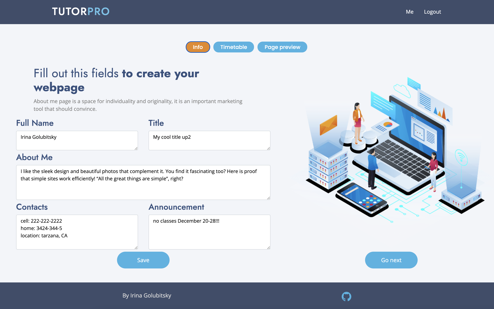
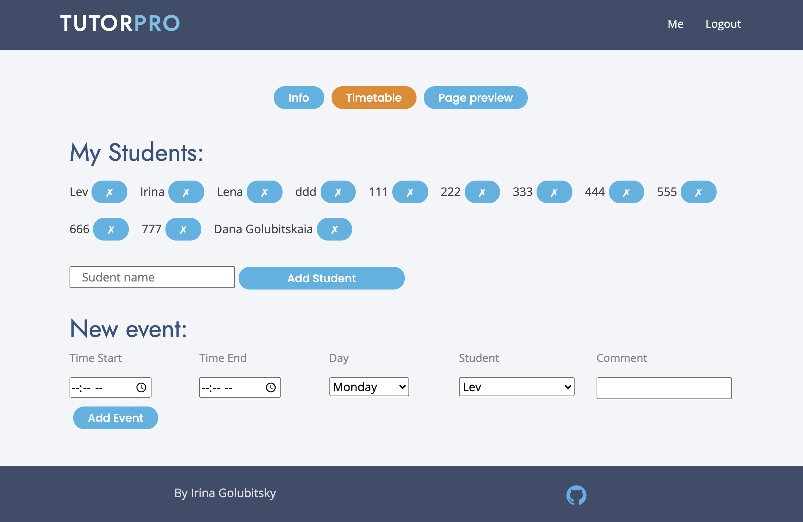
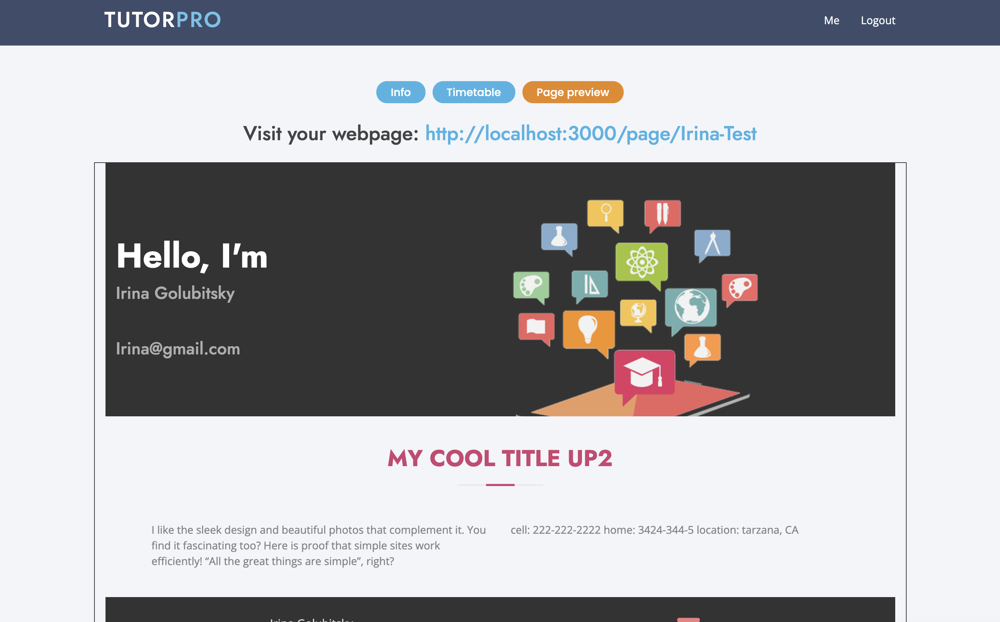

# tutor-pro 
​
Tutorpro is a platform where private tutors can create a webpage to advertise their service. 
​
## Technologies Used

* React
* GraphQ
* Node.js
* Express.js server
* MongoDB
* Mongoose ODM
* JWT
* Bootstrap.

## Description 

The purpose of this app is to provide private tutors with an easy-to-use tool to share their info and week schedule.  TutorPro allows to create one-week timetable.  Students are never going to forget their timetable and also can contact a tutor to reschedule classes knowing which hours are free.

## Table of Contents 
- [Deployed](#deployed)
- [License](#license)
- [ScreenShot](#screenshot)
- [Questoins](#questions)

## Deployed

https://ig-tutorpro.herokuapp.com/

## License 
  
  The MIT License

## ScreenShot
  
   |  |
   | :---: | :---: |
 |  |
   
## Questions
If you hane any questions:
  
  Get in touch with me on Github [Irina-Golubitsky](https://github.com/Irina-Golubitsky)
  
  Email me irina.golubitsky@gmail.com
